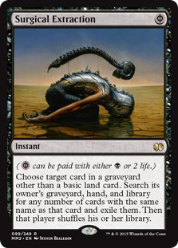

## surgical-extraction



### Motivation

The purpose of this utility is to separate `go-ipfs` source packages from its repo structure and development pipeline. IPFS heavily relies on its own [package management tool — Gx](https://github.com/whyrusleeping/gx), that breaks idiomatic Go pratices and reduces the security of the codebase. Also makes the source code `go get`-incompatible.

### How it's solved

`surgical-extraction` takes a few arguments, one of them is a path to an executable (any main) package that imports all required IPFS packages. It then deduces the full dependency tree of that executable and moves all dependencies into proper Go-friendly namespace, any vendored deps are being placed into vendor and all the import paths are being rewritten.

`surgical-extraction` also keeps records on how import paths have been changed from time to time, so when the original source has been updated, its new place is correctly resolved and the source files can be safely migrated.

**Example:**

1) Package 
`gx/ipfs/QmVSep2WwKcXxMonPASsAJ3nZVjfVMKgMcaSigxKnUWpJv/go-libp2p-kad-dht` detected as a dependency;
2) Extracted into `vendor/unknown/go-libp2p-kad-dht`;
3) If `go-libp2p-kad-dht` is replaced with a new version in the original sources, it will be extracted to the same path in vendor;
4) A proper package name is recognized manually as `github.com/libp2p/go-libp2p-kad-dht`, package is being relocated `vendor/github.com/libp2p/go-libp2p-kad-dht` using `surgical-extraction relocate`;
5) If `go-libp2p-kad-dht` is replaced with a new version in the original sources, it will be extracted to the same path in vendor;
6) We decided to unvendor that package as a subpackage. We use `surgical-extraction unvendor` and the pacakge now belongs to `go-libp2p-kad-dht` in the project root.
7) If `go-libp2p-kad-dht` is replaced with a new version in the original sources, it will be ignored, however it's possible to generate a diff file for the tracking of changes.

### Usage

This tool is currently in experimental mode. Only automatic vendoring/relocation is implemented, also there is no state tracking. Use with caution, it may overwrite your code.

```bash
$ surgical-extraction extract
main.go:189: [INFO] found 143 deps vendored using Gx
main.go:201: [INFO] found 1 deps vendored using Godeps
main.go:230: [INFO] found 21 packages from IPFS

$ du -csh extraction.json
564K    extraction.json

$ surgical-extraction extract --apply
# copies sources over...
```

### License

MIT
